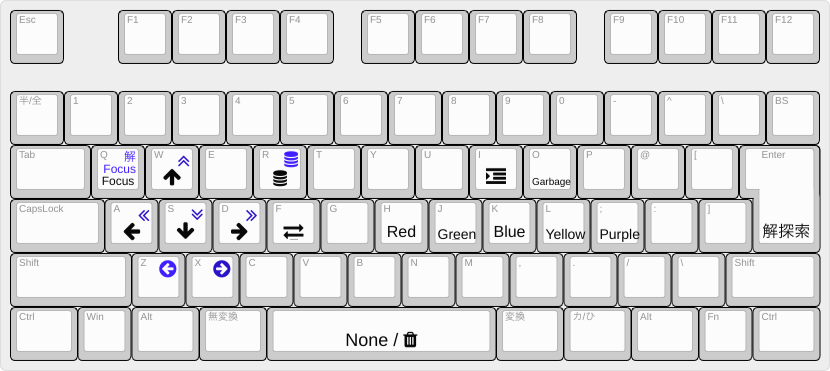
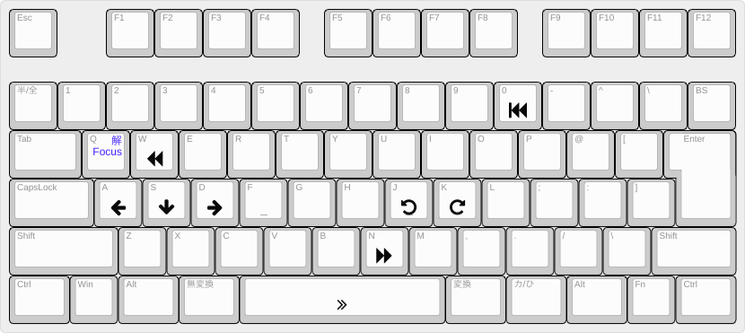
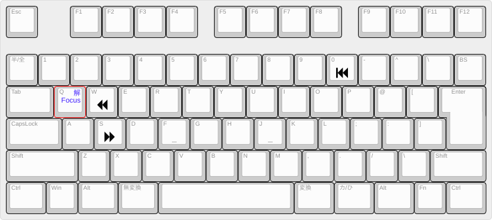
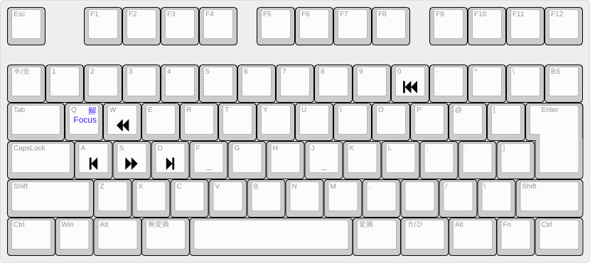

# GUIアプリケーション

なぞぷよを編集したり，自分でプレイしたりすることができる．

## 使い方

以下を実行する：

```shell
pon2 [<uri>] [options]
```

例：

```shell
pon2 https://ishikawapuyo.net/simu/pn.html?Mp6j92mS_o1q1__u03
```

Windowsではアプリケーション起動中に黒いコンソール画面が出るが，仕様である．

## オプション

| オプション | 説明                     | デフォルト値 |
| ---------- | ------------------------ | ------------ |
| -h         | ヘルプ画面を表示する．   | しない       |

## キーボードショートカット

以下では，青文字はShiftキーとの同時押しを表す．

### 編集画面



### プレイ画面



### 再生画面



### 解答表示画面

