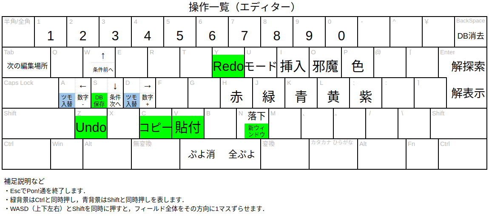
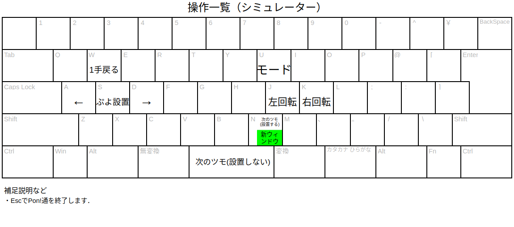
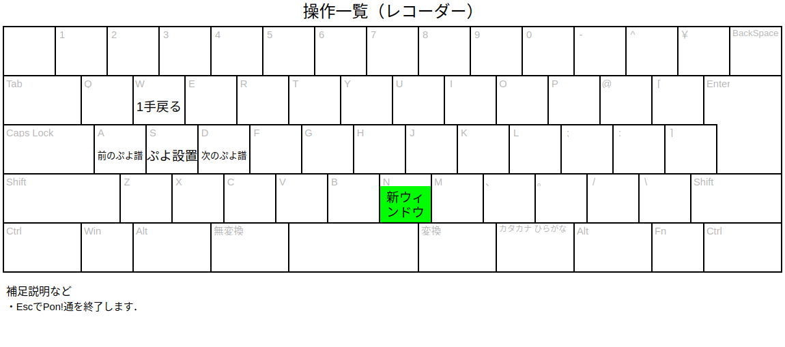

###################
GUIアプリケーション
###################

なぞぷよを編集したり，自分でプレイしたりすることができる．
エディター・シミュレーター・レコーダーの3種類のモードが搭載されている．

エディター
    なぞぷよを編集するためのモード．編集機能や解探索機能が備わっている．

シミュレーター
    なぞぷよを自分でプレイするためのモード．

レコーダー
    ぷよ譜を再生するためのモード．解探索の結果を確認するために用いる．

******
使い方
******

以下を実行する::

    pon2 [<url> options]

例::

    pon2 https://ishikawapuyo.net/simu/pn.html?Mp6j92mS_o1q1__u03

URLを与えた場合，URLをシミュレーターで起動する．
URLを与えない場合，エディターが起動する．

Windowsではアプリケーション起動中に黒いコンソール画面が出るが，仕様である．

**********
オプション
**********

========== ======================== =============
オプション 説明                     デフォルト値
========== ======================== =============
-h         ヘルプ画面を表示する．   しない
========== ======================== =============

********************
コマンド一覧（共通）
********************

========= ==============================================
コマンド  説明                                         
========= ==============================================
Ctrl+N    現在のウィンドウをコピーしたウィンドウを開く．
Esc       Pon!通を終了する（確認ウィンドウが開く）．
========= ==============================================

**************************
コマンド一覧（エディター）
**************************

チートシート
============

共通操作一覧
============

========== ==============================================================
コマンド   説明                                         
========== ==============================================================
Ctrl+C     なぞぷよのURLをコピーする．
Ctrl+V     コピーされているURLからなぞぷよを読み込む．
Ctrl+Z     元に戻す．
Ctrl+Y     やり直す．
Tab        カーソルの操作対象を変更する．
U          シミュレーターモードに切り替える．
Enter      解探索をする．探索済の場合は解を再生するレコーダーを起動する．
Ctrl+S     データベースになぞぷよを保存する．
BackSpace  データベースからなぞぷよを削除する．
========== ==============================================================

フィールド操作一覧
==================

========= ===================================
コマンド  説明
========= ===================================
W         カーソルを上に移動する．
A         カーソルを左に移動する．
S         カーソルを下に移動する．
D         カーソルを右に移動する．
Space     カーソル位置のぷよを消去する．
O         カーソル位置をお邪魔ぷよにする．
H         カーソル位置を赤ぷよにする．
J         カーソル位置を緑ぷよにする．
K         カーソル位置を青ぷよにする．
L         カーソル位置を黄ぷよにする．
;         カーソル位置を紫ぷよにする．
Shift+W   フィールドを上に1段ずらす．
Shift+A   フィールドを左に1列ずらす．
Shift+S   フィールドを下に1段ずらす．
Shift+D   フィールドを右に1列ずらす．
I         挿入モードのon・offを切り替える．
N         浮いているぷよを落下させる．
========= ===================================

ツモ操作一覧
============

========= ==================================================
コマンド  説明
========= ==================================================
W         カーソルを上に移動する．
A         カーソルを左に移動する．
S         カーソルを下に移動する．
D         カーソルを右に移動する．
Space     カーソル位置のツモを消去する．
H         カーソル位置を赤ぷよにする．
J         カーソル位置を緑ぷよにする．
K         カーソル位置を青ぷよにする．
L         カーソル位置を黄ぷよにする．
;         カーソル位置を紫ぷよにする．
Shift+A   カーソル位置のツモの軸ぷよ・子ぷよを入れ替える．
Shift+D   カーソル位置のツモの軸ぷよ・子ぷよを入れ替える．
I         挿入モードのon・offを切り替える．
========= ==================================================

クリア条件操作一覧
==================

========= ==================================================
コマンド  説明
========= ==================================================
W         クリア条件の種類を1つ前に戻す．
A         クリア条件の数字（n個）を1つ減らす．
S         クリア条件の種類を1つ前に戻す．
D         クリア条件の数字（n個）を1つ増やす．
Space     クリア条件の色（cぷよ）を全ぷよに設定する．
H         クリア条件の色（cぷよ）を赤ぷよに設定する．
J         クリア条件の色（cぷよ）を緑ぷよに設定する．
K         クリア条件の色（cぷよ）を青ぷよに設定する．
L         クリア条件の色（cぷよ）を黄ぷよに設定する．
;         クリア条件の色（cぷよ）を紫ぷよに設定する．
O         クリア条件の色（cぷよ）をお邪魔ぷよに設定する．
P         クリア条件の色（cぷよ）を色ぷよに設定する．
Shift+A   カーソル位置のツモの軸ぷよ・子ぷよを入れ替える．
Shift+D   カーソル位置のツモの軸ぷよ・子ぷよを入れ替える．
1-9       クリア条件の数字（n個）を設定する．
========= ==================================================

******************************
コマンド一覧（シミュレーター）
******************************

チートシート
============

========= ====================================
コマンド  説明
========= ====================================
W         1手戻る．
A         左にツモを移動する．
S         ツモを設置する．
D         右にツモを移動する．
K         ツモを右回転する．
J         ツモを左回転する．
Space     現在のツモを飛ばす．
N         保存されている場所にツモを設置する．
U          エディターモードに切り替える．
========= ====================================

**************************
コマンド一覧（レコーダー）
**************************

チートシート
============

========= ========================
コマンド  説明
========= ========================
W         1手戻る．
A         前のレコードを再生する．
S         ツモを設置する．
D         次のレコードを再生する．
========= ========================
